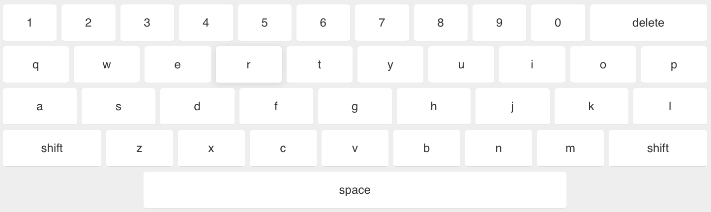

# Onscreen-Keyboard
A beautiful jQuery onscreen keyboard by [Jeremy Blaze](https://jeremyblaze.com)



***

## Instructions

**1. Include necessary files**

```
<!--jQuery-->
<script type="text/javascript" src="https://code.jquery.com/jquery-3.3.1.min.js"></script>

<!--Caret plugin by Gideon Sireling (https://plugins.jquery.com/caret/)-->
<script type="text/javascript" src="jquery.caret.js"></script>

<!--Onscreen Keyboard-->
<link rel="stylesheet" type="text/css" href="jquery.onscreenKeyboard.css" />
<script type="text/javascript" src="jquery.onscreenKeyboard.js"></script>
```


**2. Initialize the plugin**

```
<script type="text/javascript">
	$(document).ready(function(){
	    $('.onscreenKeyboard').onscreenKeyboard({
	        type: 'qwerty', // this can be either 'qwerty' or 'numeric'
	        caps: true, // start the keyboard in caps mode
	        allowTypingClass: 'onscreenKeyboardTarget' // add this class to elements which can be typed in    });
		});
	});
</script>
```

(For details on the different options available, read the comments in the code snippet above)

***

## To do

- [x] Basic version
- [ ] Make size adjust for mobile devices
- [ ] Improve key feel on touch devices
- [ ] Add numeric keyboard
- [ ] Add symbols keyboard